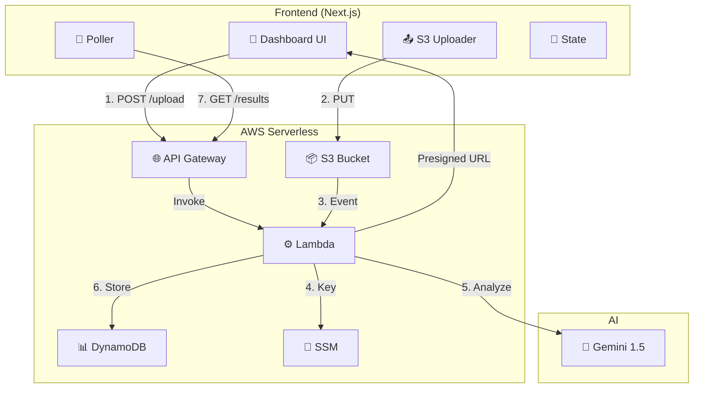

# 🏛️ AI Compliance Dashboard

> An enterprise-grade serverless AI document auditing platform that automates risk assessment of legal and compliance documents against global standards (GDPR, SOC 2, CCPA) using Google Gemini and AWS.

**Live Demo:** [your-vercel-deployment-url]  
**GitHub:** [@YOUR_USERNAME](https://github.com/YOUR_USERNAME/ai-compliance-dashboard)

---

## ⚡ Quick Start

### For End Users
1. Visit the deployed app
2. Upload a PDF, DOCX, or TXT document
3. Wait 10–15 seconds for AI analysis
4. View compliance score and risk breakdown

### For Developers
```bash
git clone https://github.com/YOUR_USERNAME/ai-compliance-dashboard.git
cd ai-compliance-dashboard
export NEXT_PUBLIC_API_BASE_URL="https://your-api.execute-api.us-east-1.amazonaws.com"
pnpm install && pnpm dev
```

Open `http://localhost:3000`.

---

## 🏗️ System Architecture



### Data Flow (10 Steps)
1. User uploads document
2. Frontend requests presigned URL → `POST /upload`
3. Lambda generates URL + documentId
4. Frontend uploads binary to S3 (presigned PUT)
5. S3 triggers Lambda via ObjectCreated event
6. Lambda extracts text from file
7. Lambda calls Gemini API for analysis
8. Lambda stores results in DynamoDB
9. Frontend polls results every 3 seconds
10. UI updates with gauges + heatmap

---

## 🎯 Key Features

| Feature | Benefit |
|---------|---------|
| **Serverless Auto-Scaling** | Zero idle costs, pay-per-use Lambda |
| **Secure Presigned URLs** | Direct S3 uploads, avoid Lambda bottleneck |
| **Multi-Format Support** | PDF, DOCX, TXT with fallbacks |
| **AI-Powered Scoring** | Google Gemini structured analysis |
| **Real-Time Visualization** | Gauges update as results arrive |
| **Risk Heatmap** | Color-coded compliance grid |
| **Audit Trail** | Complete finding logs |
| **Responsive UI** | Works on desktop & mobile |

---

## 🛠️ Tech Stack

**Frontend:** Next.js 15 + React 19 + TypeScript + Tailwind CSS + Shadcn UI  
**Backend:** AWS Lambda (Python 3.11) + API Gateway HTTP API v2  
**Database:** Amazon DynamoDB (NoSQL) + S3 (document storage)  
**Secrets:** AWS SSM Parameter Store  
**Infrastructure:** Terraform (IaC)  
**AI:** Google Gemini 1.5 Flash  
**Deployment:** Vercel (frontend) + AWS (backend)

---

## 📂 Project Structure

```
components/dashboard/          # UI components
  ├── compliance-dashboard.tsx  # Main layout
  ├── document-auditor.tsx      # Upload + polling
  ├── compliance-gauges.tsx     # Score visualization
  ├── risk-heatmap.tsx          # Risk grid
  ├── audit-log.tsx             # Findings list
  └── ...
hooks/
  ├── use-audit-engine.ts       # State machine
  └── audit-engine-context.tsx  # React Context
terraform/
  ├── main.tf                   # AWS infrastructure
  └── lambda_src/index.py       # Lambda handler
```

---

## 🔄 How It Works

### Phase 1: Upload Request
```
User selects file → POST /upload → Lambda returns presigned URL
```

### Phase 2: Direct S3 Upload
```
Frontend PUTs file to presigned URL → S3 triggers Lambda
```

### Phase 3: Backend Processing
```
Lambda extracts text → Calls Gemini → Stores in DynamoDB
```

### Phase 4: Frontend Polling
```
Polls /results/{documentId} every 3 sec → When complete, updates state
```

### Phase 5: Visualization
```
Gauges render compliance scores → Heatmap renders risk levels
```

---

## 📊 Compliance Scoring

### Score Calculation
```
Gemini returns 0–100 score
  → Normalized to 0–100 range
  → Displayed with color coding:
    🔴 0–25: Red (Critical)
    🟠 26–50: Orange (High)
    🟡 51–75: Yellow (Medium)
    🟢 76–100: Green (Low)
```

### Multi-Framework Analysis
- **GDPR:** Data protection readiness
- **SOC2:** Security controls maturity
- **CCPA:** Privacy law compliance

### Gauge Calculation
```
Overall = Average of all document scores
GDPR = clamp(overall - 6)
SOC2 = clamp(overall + 5)
CCPA = clamp(overall - 1)
```

### Risk Heatmap
Derived from backend findings with keyword-based categorization:
1. Backend returns findings (text)
2. Frontend infers category (Data Protection, Governance, Liability, etc.)
3. Frontend infers risk level (Critical → High → Medium → Low)
4. Heatmap displays color grid

---

## 🚀 Getting Started

### Prerequisites
- AWS Account (free tier eligible)
- Google Cloud project with Gemini API enabled
- Node.js 18+ & pnpm
- Terraform 1.0+

### Step 1: Clone & Set Up Infrastructure
```bash
git clone https://github.com/YOUR_USERNAME/ai-compliance-dashboard.git
cd ai-compliance-dashboard/terraform

terraform init

# Create Gemini API key in AWS SSM
aws ssm put-parameter \
  --name "/prod/gemini/api_key" \
  --value "YOUR_GEMINI_API_KEY" \
  --type "SecureString" \
  --region us-east-1

terraform apply
```

### Step 2: Get API Endpoint
```bash
terraform output api_endpoint
# Output: https://vbkod6j4wc.execute-api.us-east-1.amazonaws.com
```

### Step 3: Configure Frontend
```bash
cd ..
cat > .env.local << EOF
NEXT_PUBLIC_API_BASE_URL=https://vbkod6j4wc.execute-api.us-east-1.amazonaws.com
EOF
```

### Step 4: Run Frontend
```bash
pnpm install
pnpm dev
```

Visit `http://localhost:3000`.

---

## 🌐 Deploy to Vercel

### Step 1: Push to GitHub
```bash
git add .
git commit -m "Add AI Compliance Dashboard"
git push -u origin main
```

### Step 2: Import to Vercel
1. Visit [vercel.com/new](https://vercel.com/new)
2. Import your repository
3. Vercel auto-detects Next.js
4. Add environment variable:
   ```
   NEXT_PUBLIC_API_BASE_URL=https://your-api.execute-api.us-east-1.amazonaws.com
   ```
5. Click Deploy

### Step 3: Update CORS in AWS
Update [terraform/main.tf](terraform/main.tf):
```hcl
allow_origins = [
  "http://localhost:3000",
  "https://your-project.vercel.app"
]
```

Redeploy:
```bash
cd terraform
terraform apply
```

---

## 🔒 Security

### Implemented ✅
- ✅ Presigned S3 URLs (no long-lived credentials)
- ✅ Gemini API key in SSM (not in code)
- ✅ CORS restricted to localhost + Vercel domain
- ✅ IAM fine-grained roles for Lambda
- ✅ Terraform state ignored from Git
- ✅ `.env*.local` excluded from Git

### For Production (To-Do)
- [ ] Add AWS Cognito authentication
- [ ] JWT authorizer on API Gateway routes
- [ ] Rate limiting on endpoints
- [ ] S3 encryption at rest + in transit
- [ ] CloudWatch logging + alarms
- [ ] API Gateway WAF (Web Application Firewall)

---

## 💰 Cost Estimation

| Service | Free Tier | After |
|---------|-----------|-------|
| Lambda | 1M requests | $0.20/M |
| API Gateway | 1M requests | $3.50/M |
| S3 | 5 GB | $0.023/GB |
| DynamoDB | 25 GB | $1.25/M writes |
| **Total (10 docs/day)** | **Free** | **~$5–10** |

> **Gemini API:** Free = 15 req/min; Paid = $0.075 per 1M tokens

---

## 🐛 Troubleshooting

**404 Error:** Check if `NEXT_PUBLIC_API_BASE_URL` is set:
```bash
echo $NEXT_PUBLIC_API_BASE_URL
```

**Lambda Timeout:** Increase timeout in [terraform/main.tf](terraform/main.tf) (default 900s)

**CORS Error:** Update `allow_origins` in [terraform/main.tf](terraform/main.tf) and run `terraform apply`

**Gemini Rate Limited:** Wait 60 seconds or upgrade to Gemini Pro

---

## 📚 Documentation

- **[INFRASTRUCTURE.md](./INFRASTRUCTURE.md)** — Detailed deployment guide
- **[terraform/main.tf](./terraform/main.tf)** — Full AWS configuration
- **[terraform/lambda_src/index.py](./terraform/lambda_src/index.py)** — Lambda handler

---

## 📄 License

MIT License — See `LICENSE` file

---

**Built as a portfolio showcase of Cloud Native AI Engineering**  
**Last Updated:** September 2026  
**Status:** ✅ Production-Ready Portfolio Project

---

## End-to-End Workflow (ARCHIVED - Detailed Reference)

### 1) Upload (Frontend)
**File:** `components/dashboard/document-auditor.tsx`

- Uses `IngestionDropzone` to accept file input.
- Calls the API Gateway endpoint:
  - `POST /upload`
- Receives:
  - `uploadUrl` (presigned S3 URL)
  - `documentId`

Then it updates the dashboard pipeline state:
- `registerPendingDocument({ id, name, sizeBytes, fileType })`

### 2) Upload Binary to S3
**File:** `components/dashboard/document-auditor.tsx`

- Performs `PUT uploadUrl` directly to S3.
- Tracks upload progress locally (UI only).

### 3) Backend Processing (AWS)
**File:** `terraform/lambda_src/index.py`

Lambda has two major paths:

#### A) S3 trigger event
- Detects `event['Records'][0]['s3']`
- Extracts text from the uploaded object:
  - PDF: uses `pypdf` if available
  - DOCX: parses `word/document.xml` from the zip
  - TXT: UTF-8 decode fallback
- If extraction fails, uses a heuristic fallback.

Then it calls Groq:
- `_call_groq(raw_text)`
  - score request: returns a single integer 0–100
  - highlights request: returns up to 5 findings separated by `||`
- Stores results in DynamoDB:
  - `Status = COMPLETED`
  - `Score = compliance_score`
  - `Findings = risk_highlights`

If anything fails:
- `Status = FAILED`
- `Error = str(e)`

#### B) API Gateway REST endpoints
- `POST /upload`
  - Generates a presigned URL:
    - bucket: `enterprise-compliance-vault-2026`
    - key: `filename` (used as `documentId`)
- `GET /results/{id}`
  - Reads DynamoDB item by `DocumentId`
  - Returns JSON with `Status`, `Score`, `Findings`, etc.

### 4) Poll for Results (Frontend)
**File:** `components/dashboard/document-auditor.tsx`

- Polls `GET /results/{documentId}` every ~3s.
- When `Status === "COMPLETED"`:
  - calls `finalizeDocument(...)`

### 5) Update shared UI state (Frontend)
**File:** `hooks/use-audit-engine.ts`

`finalizeDocument()` converts backend findings into the UI model:

- `clauses` are created from `findings: string[]`
- each clause has:
  - `category` inferred from keywords
  - `riskLevel` inferred from keywords
- `riskByCategory` is computed as the maximum risk level per category

Then it sets:
- `stage = "complete"`
- `complianceScore = payload.score`

### 6) Render Gauges + Heatmap
**Files:**
- `components/dashboard/compliance-gauges.tsx`
- `components/dashboard/risk-heatmap.tsx`

Both components receive `documents` from the shared context and render only when:
- `d.stage === "complete"`

---

## How Compliance Gauges are calculated

All gauges are derived from the per-document `complianceScore`.

### Overall
Average of all complete documents’ `complianceScore` (rounded).

### GDPR / SOC2 / CCPA
Simple derived offsets from `overall`:
- `GDPR = clamp(overall - 6)`
- `SOC2 = clamp(overall + 5)`
- `CCPA = clamp(overall - 1)`

`clamp()` keeps values in `[4, 99]`.

---

## How the Risk Heatmap is calculated

The heatmap uses `riskByCategory` computed from:

1. Backend `Findings` (array of strings)
2. Frontend inference:
   - `inferRiskCategory(text)` → category (keyword-based)
   - `inferRiskLevel(text)` → risk level (keyword-based)
3. `buildRiskMap(clauses)` → max risk level per category

So **heatmap is derived from Findings**, not directly from the compliance score.

---

## Project Structure (key files)

- `app/page.tsx` – page entry
- `components/dashboard/compliance-dashboard.tsx` – main layout
- `components/dashboard/document-auditor.tsx` – upload + polling + state updates
- `components/dashboard/compliance-gauges.tsx` – gauge UI
- `components/dashboard/risk-heatmap.tsx` – heatmap UI
- `hooks/use-audit-engine.ts` – shared state machine + clause/risk mapping
- `hooks/audit-engine-context.tsx` – context provider
- `terraform/lambda_src/index.py` – AWS Lambda + Groq + DynamoDB logic

---

## Local Development

1. Install deps:
   - `pnpm install`
2. Run Next.js:
   - `pnpm dev`

Then upload documents through the UI.

> The backend is remote (API Gateway + S3 + DynamoDB) using the configured endpoint in `document-auditor.tsx`.

---

## Known Limitations / Notes

- The risk categorization and risk level inference is currently **keyword-based on the frontend**.
- Compliance gauges (GDPR/SOC2/CCPA) are **derived from overall score via simple offsets**, not separately computed by the backend.
- This repo currently includes temporary debug logging during troubleshooting; remove them if desired.

