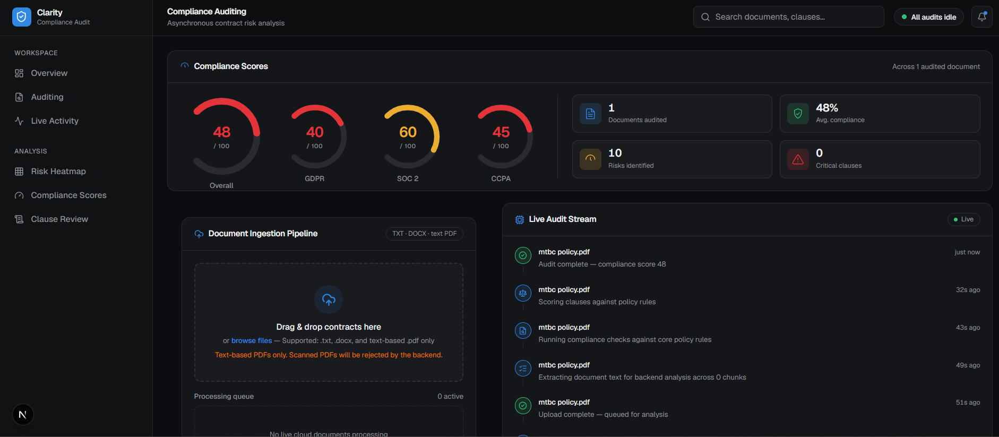
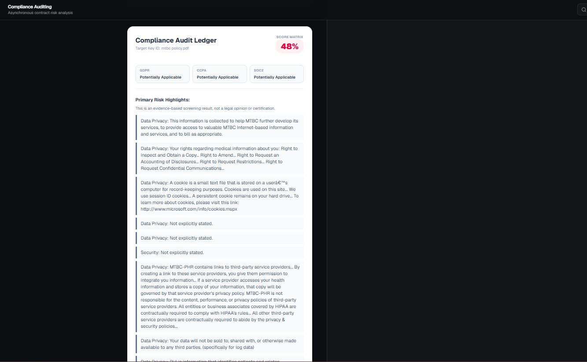
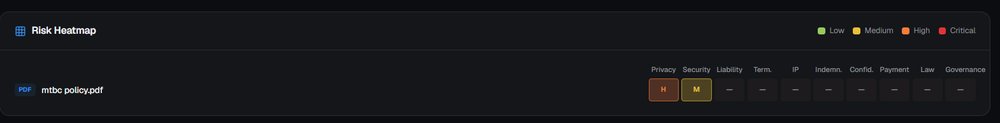
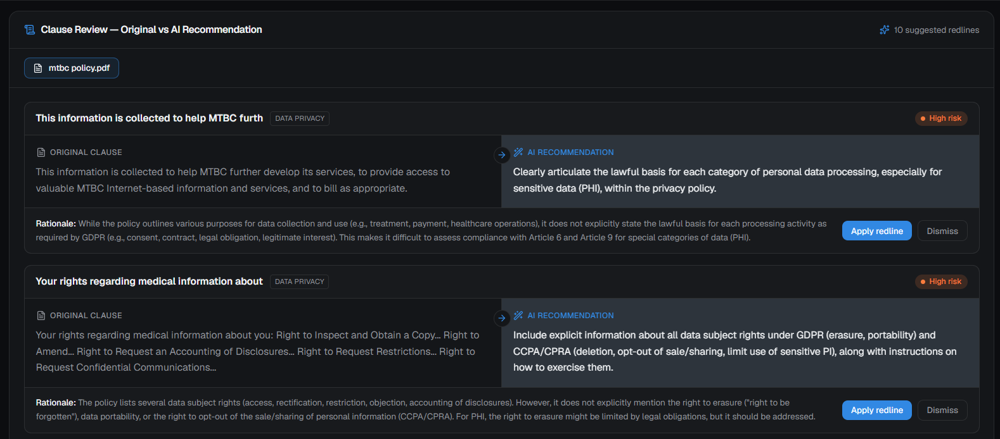
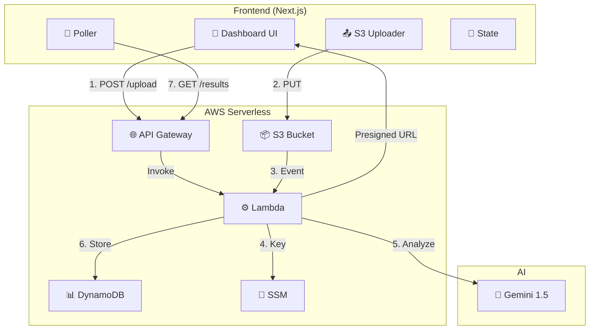

<div align="center">

# 🛡️ Clarity — AI Compliance Dashboard

**Enterprise-grade serverless AI auditing for legal & compliance documents.**
Upload a contract or policy → get a GDPR / SOC 2 / CCPA risk score, a clause-by-clause heatmap, and AI-drafted redlines in seconds.

[](https://intelligent-enterprise-compliance-auditor.vercel.app/)


**[🚀 Live Demo](https://intelligent-enterprise-compliance-auditor.vercel.app/)** · **[📦 GitHub](https://github.com/t-kiran-05/Intelligent-Enterprise-Compliance-Auditor)** · **[📚 Infrastructure Docs](./INFRASTRUCTURE.md)**

</div>

<br>



<br>

## 📖 Table of Contents

- [Overview](#-overview)
- [Screenshots](#-screenshots)
- [Key Features](#-key-features)
- [System Architecture](#️-system-architecture)
- [Tech Stack](#️-tech-stack)
- [How It Works](#-how-it-works)
- [Compliance Scoring](#-compliance-scoring)
- [Getting Started](#-getting-started)
- [Deploy to Vercel](#-deploy-to-vercel)
- [Project Structure](#-project-structure)
- [Security](#-security)
- [Cost Estimation](#-cost-estimation)
- [Troubleshooting](#-troubleshooting)
- [Known Limitations](#-known-limitations)
- [License](#-license)

<br>

## 🔍 Overview

Clarity is a portfolio-grade, fully serverless platform that automates first-pass legal and compliance review. Drop in a **PDF, DOCX, or TXT** document, and within 10–15 seconds it returns:

- An **overall compliance score** and framework-level breakdowns for **GDPR**, **SOC 2**, and **CCPA**
- A **clause-level risk heatmap** across categories like Privacy, Security, Liability, and Governance
- **AI-generated redlines** — side-by-side "original vs. recommended" clause rewrites with rationale
- A **live audit trail** of every step the pipeline takes, from upload to scoring

Everything runs on pay-per-use infrastructure — there's no server sitting idle, and no cost when nobody's auditing a document.

<br>

## 📸 Screenshots

<table>
<tr>
<td width="100%">

**Compliance Overview**
Real-time gauges, ingestion pipeline, and a live audit stream as documents move through the pipeline.


</td>
<td width="100%">

**Compliance Audit Ledger**
A shareable score matrix with per-framework applicability and the primary risk highlights driving the score.



</td>
</tr>
<tr>
<td width="100%">

**Risk Heatmap**
Every document scored across ten risk categories, color-coded from Low to Critical.



</td>
<td width="100%">

**Clause Review — Original vs. AI Recommendation**
Side-by-side redlines with a rationale for each flagged clause — apply or dismiss with one click.



</td>
</tr>
</table>

<br>

## 🎯 Key Features

| Feature | Benefit |
|---|---|
| ⚡ **Serverless auto-scaling** | Zero idle cost — Lambda scales to zero and back on demand |
| 🔐 **Secure presigned URLs** | Documents upload directly to S3, bypassing the Lambda bottleneck |
| 📄 **Multi-format support** | PDF, DOCX, and TXT, with heuristic fallbacks for tricky extractions |
| 🤖 **AI-powered scoring** | Structured risk analysis via Google Gemini |
| 📊 **Real-time visualization** | Gauges and heatmaps update live as results land |
| 🗺️ **Risk heatmap** | Color-coded grid across 10 compliance categories |
| ✍️ **AI redlines** | Clause-level rewrite suggestions with rationale, ready to apply |
| 📝 **Audit trail** | A full, timestamped log of every finding and pipeline step |
| 📱 **Responsive UI** | Built to work cleanly on desktop and mobile |

<br>

## 🏗️ System Architecture



**Data flow, step by step:**

1. User uploads a document in the UI
2. Frontend requests a presigned URL → `POST /upload`
3. Lambda generates the URL plus a `documentId`
4. Frontend PUTs the file binary directly to S3
5. S3 fires an `ObjectCreated` event → triggers Lambda
6. Lambda extracts text from the file
7. Lambda sends the text to Gemini for structured analysis
8. Lambda writes results to DynamoDB
9. Frontend polls `GET /results/{id}` every 3 seconds
10. UI updates gauges, heatmap, and audit stream as results arrive

<br>

## 🛠️ Tech Stack

| Layer | Technology |
|---|---|
| **Frontend** | Next.js 15 · React 19 · TypeScript · Tailwind CSS · shadcn/ui |
| **Backend** | AWS Lambda (Python 3.11) · API Gateway HTTP API v2 |
| **Storage** | Amazon DynamoDB (results) · S3 (documents) |
| **Secrets** | AWS SSM Parameter Store |
| **Infrastructure** | Terraform (IaC) |
| **AI** | Google Gemini 1.5 Flash |
| **Deployment** | Vercel (frontend) · AWS (backend) |

<br>

## ⚙️ How It Works

**Phase 1 — Upload request**
```
User selects file → POST /upload → Lambda returns a presigned URL
```

**Phase 2 — Direct S3 upload**
```
Frontend PUTs the file to the presigned URL → S3 triggers Lambda
```

**Phase 3 — Backend processing**
```
Lambda extracts text → calls Gemini → stores results in DynamoDB
```

**Phase 4 — Frontend polling**
```
Poll GET /results/{documentId} every 3s → on COMPLETED, hydrate state
```

**Phase 5 — Visualization**
```
Gauges render compliance scores → heatmap renders per-category risk
```

<br>

## 📊 Compliance Scoring

### Score bands

| Score | Color | Meaning |
|---|---|---|
| 0–25 | 🔴 Red | Critical |
| 26–50 | 🟠 Orange | High |
| 51–75 | 🟡 Yellow | Medium |
| 76–100 | 🟢 Green | Low |

### Frameworks analyzed
- **GDPR** — data protection readiness
- **SOC 2** — security controls maturity
- **CCPA** — privacy law compliance

### Gauge calculation

Gemini returns a single 0–100 score per document. Framework gauges are derived from the overall average via fixed offsets, then clamped to `[4, 99]`:

```
Overall = average(all document scores)
GDPR    = clamp(overall - 6)
SOC 2   = clamp(overall + 5)
CCPA    = clamp(overall - 1)
```

### Risk heatmap

The heatmap is derived from backend **findings**, not directly from the score:

1. Lambda returns a list of finding strings from Gemini
2. Frontend infers a **category** per finding (keyword-based: Privacy, Security, Liability, Governance, etc.)
3. Frontend infers a **risk level** per finding (keyword-based: Critical → High → Medium → Low)
4. The heatmap shows the **maximum** risk level per category, across all findings

<br>

## 🚀 Getting Started

### Prerequisites
- AWS account (free tier eligible)
- Google Cloud project with the Gemini API enabled
- Node.js 18+ and pnpm
- Terraform 1.0+

### 1. Clone and provision infrastructure

```bash
git clone https://github.com/YOUR_USERNAME/ai-compliance-dashboard.git
cd ai-compliance-dashboard/terraform

terraform init

# Store your Gemini API key in AWS SSM
aws ssm put-parameter \
  --name "/prod/gemini/api_key" \
  --value "YOUR_GEMINI_API_KEY" \
  --type "SecureString" \
  --region us-east-1

terraform apply
```

### 2. Grab the API endpoint

```bash
terraform output api_endpoint
# e.g. https://vbkod6j4wc.execute-api.us-east-1.amazonaws.com
```

### 3. Configure the frontend

```bash
cd ..
cat > .env.local << EOF
NEXT_PUBLIC_API_BASE_URL=https://vbkod6j4wc.execute-api.us-east-1.amazonaws.com
EOF
```

### 4. Run it

```bash
pnpm install
pnpm dev
```

Open **http://localhost:3000** and upload a document.

<br>

## 🌐 Deploy to Vercel

**1. Push to GitHub**
```bash
git add .
git commit -m "Add AI Compliance Dashboard"
git push -u origin main
```

**2. Import to Vercel**
1. Visit [vercel.com/new](https://vercel.com/new)
2. Import the repository (Next.js is auto-detected)
3. Add the environment variable:
   ```
   NEXT_PUBLIC_API_BASE_URL=https://your-api.execute-api.us-east-1.amazonaws.com
   ```
4. Click **Deploy**

**3. Update CORS in AWS**

In `terraform/main.tf`:
```hcl
allow_origins = [
  "http://localhost:3000",
  "https://intelligent-enterprise-compliance-auditor.vercel.app"
]
```

```bash
cd terraform
terraform apply
```

> **Live instance:** [intelligent-enterprise-compliance-auditor.vercel.app](https://intelligent-enterprise-compliance-auditor.vercel.app/)

<br>

## 📂 Project Structure

```
components/dashboard/
├── compliance-dashboard.tsx   # Main layout
├── document-auditor.tsx       # Upload + polling + state updates
├── compliance-gauges.tsx      # Score visualization
├── risk-heatmap.tsx           # Risk grid
├── audit-log.tsx              # Findings list
└── ...

hooks/
├── use-audit-engine.ts        # Shared state machine + clause/risk mapping
└── audit-engine-context.tsx   # React Context provider

terraform/
├── main.tf                    # AWS infrastructure
└── lambda_src/index.py        # Lambda handler (extraction, Gemini call, DynamoDB)
```

<br>

## 🔒 Security

**Implemented**
- ✅ Presigned S3 URLs — no long-lived credentials on the client
- ✅ Gemini API key stored in SSM, never in code
- ✅ CORS restricted to localhost + the Vercel domain
- ✅ Fine-grained IAM roles for Lambda
- ✅ Terraform state and `.env*.local` excluded from Git

**Roadmap for production**
- [ ] AWS Cognito authentication
- [ ] JWT authorizer on API Gateway routes
- [ ] Rate limiting on endpoints
- [ ] S3 encryption at rest and in transit
- [ ] CloudWatch logging + alarms
- [ ] API Gateway WAF

<br>

## 💰 Cost Estimation

| Service | Free tier | After free tier |
|---|---|---|
| Lambda | 1M requests | $0.20 / million |
| API Gateway | 1M requests | $3.50 / million |
| S3 | 5 GB | $0.023 / GB |
| DynamoDB | 25 GB | $1.25 / million writes |
| **Total (≈10 docs/day)** | **Free** | **~$5–10 / month** |

> Gemini API: free tier allows 15 requests/min; paid tier is $0.075 per 1M tokens.

<br>

## 🐛 Troubleshooting

| Symptom | Fix |
|---|---|
| **404 error** | Confirm `NEXT_PUBLIC_API_BASE_URL` is set: `echo $NEXT_PUBLIC_API_BASE_URL` |
| **Lambda timeout** | Increase the timeout in `terraform/main.tf` (default 900s) |
| **CORS error** | Update `allow_origins` in `terraform/main.tf`, then `terraform apply` |
| **Gemini rate limited** | Wait 60 seconds, or upgrade to a paid Gemini tier |

<br>

## 📝 Known Limitations

- Risk category and risk-level inference happen **client-side**, using keyword matching — not a separate model call.
- Framework gauges (GDPR / SOC 2 / CCPA) are **derived from the overall score** via fixed offsets, rather than computed independently by the backend.
- This is a portfolio project, not a certified compliance tool — treat every score as a **starting point for human review**, not a legal opinion.

<br>

## 📄 License

MIT License — see [`LICENSE`](./LICENSE) for details.

---

<div align="center">

**Built as a portfolio showcase of cloud-native AI engineering.**
Last updated September 2026 · Status: ✅ Production-ready portfolio project

[🚀 Try the live demo](https://intelligent-enterprise-compliance-auditor.vercel.app/)

</div>
